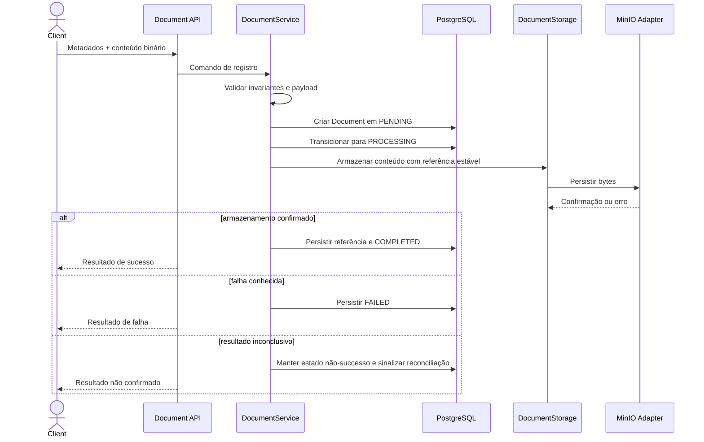

# Feature Architecture Delta — Armazenamento binário de documentos

Status: Proposed  
Owner:  
Related feature spec: [document-upload](../../02-product/document-upload/spec.md)  
Related ADRs: [ADR-001 — Armazenamento binário fora do PostgreSQL](../../01-decisions/ADR/ADR-001-document-binary-storage.md)

## Existing Architecture Affected

O fluxo atual registra somente metadados de `Document`:

```text
HTTP JSON
  → DocumentController
  → DocumentService
  → DocumentRepository
  → PostgreSQL
```

Os componentes afetados são:

- `DocumentController` e os DTOs de entrada/saída, que hoje não transportam conteúdo binário.
- `DocumentService`, que hoje apenas cria ou consulta o registro no PostgreSQL.
- `Document`, que ainda não mantém a referência ao conteúdo armazenado.
- `DocumentRepository` e o schema `documents`, que precisarão persistir a associação.
- `DocumentStorage`, que já existe como boundary provider-neutral, mas ainda não está integrado.
- `MinioDocumentStorage`, que ainda não implementa o provider.
- Configuração e infraestrutura local, que ainda não disponibilizam MinIO de forma funcional.
- Testes de serviço, integração e controller, que hoje cobrem metadados e PostgreSQL, mas não object storage.

O package raiz existente `com.dockflow.dockflow` permanece inalterado.

## Proposed Change

O registro de documento passará a coordenar metadados, conteúdo binário e referência de storage.

O `DocumentService` continuará sendo o orquestrador do caso de uso, mas dependerá somente da abstração `DocumentStorage`. O SDK e os detalhes de MinIO ficarão confinados ao adapter `MinioDocumentStorage`.

O PostgreSQL será a fonte de verdade para metadados, estado do documento e referência do objeto. O MinIO será a fonte de verdade para os bytes do documento. O conteúdo binário não será armazenado na tabela `documents`.

Não será usada transação distribuída entre PostgreSQL e MinIO. A consistência será controlada por estados explícitos, referência estável, transições condicionais e um caminho de retry/reconciliação para falhas parciais.

## Components / Boundaries

### API boundary

Responsável por receber metadados e conteúdo, aplicar validações de entrada e traduzir o resultado do caso de uso para o contrato HTTP.

Não deve conhecer o SDK do MinIO, acessar o repository diretamente ou decidir a referência do objeto.

### Document domain boundary

`Document` continua protegendo suas invariantes e seus estados:

- `PENDING`: registro criado, armazenamento ainda não concluído;
- `PROCESSING`: operação de armazenamento em andamento ou aguardando reconciliação;
- `COMPLETED`: conteúdo confirmado e referência persistida;
- `FAILED`: falha conhecida sem sucesso de armazenamento.

Nenhum estado de sucesso pode ser atribuído apenas porque a requisição foi recebida.

### Application boundary

`DocumentService` coordena:

1. validação do comando;
2. criação ou carregamento do documento;
3. transições de estado;
4. chamada ao `DocumentStorage`;
5. persistência da referência após confirmação;
6. tratamento de falhas e resultado para o consumidor.

### Persistence boundary

`DocumentRepository` permanece responsável apenas por persistência e consultas. Regras de negócio e chamadas ao storage não devem ser movidas para o repository.

### Storage boundary

`DocumentStorage` é a porta provider-neutral. A implementação MinIO deve encapsular:

- cliente e SDK do MinIO;
- endpoint, bucket e credenciais;
- conversão de erros do provider para erros do boundary;
- confirmação do resultado da operação;
- operações necessárias para retry, compensação ou reconciliação.

O domínio e o service não devem importar tipos do SDK do MinIO.

## Data Flow



A chamada ao storage não deve manter uma transação de banco aberta por toda a duração da transferência. As transações do banco devem proteger cada alteração persistente de estado, enquanto a coordenação entre os dois sistemas será feita por compensação e reconciliação.

## Runtime Scenarios

### Sucesso

1. O conteúdo e os metadados são validados.
2. O documento recebe uma identidade estável e entra em `PENDING`.
3. A operação passa para `PROCESSING`.
4. O conteúdo é escrito no MinIO usando uma referência gerada pela aplicação.
5. A confirmação do storage é recebida.
6. A referência é persistida no documento.
7. O documento passa para `COMPLETED`.
8. A resposta só é considerada sucesso após a etapa 7.

### Falha conhecida antes da confirmação

1. A operação falha por validação, indisponibilidade, timeout determinável ou rejeição do storage.
2. O documento não passa para `COMPLETED`.
3. O erro é classificado e correlacionado.
4. O documento é marcado como `FAILED` quando a falha for definitivamente conhecida.

### Resultado inconclusivo

1. A comunicação é interrompida depois de uma tentativa de escrita.
2. O sistema não declara sucesso.
3. A mesma referência estável deve ser usada para verificar ou repetir a operação, evitando uma segunda associação.
4. O estado permanece não-successo até confirmação ou falha definitiva.
5. Uma rotina de retry/reconciliação, automatizada ou operacionalmente controlada, resolve o estado e trata eventual conteúdo órfão.

### Falha ao finalizar no banco

Se o conteúdo for confirmado no MinIO, mas a persistência da referência ou do estado falhar, o documento não deve ser reportado como concluído. A ocorrência deve permanecer identificável para retry/reconciliação e, quando necessário, compensação do objeto armazenado.

## Persistence

O modelo `Document` deverá manter uma referência ao conteúdo armazenado, denominada conceitualmente `objectKey` nesta arquitetura.

Regras de persistência:

- A referência deve ser estável para o mesmo documento e não deve ser fornecida livremente pelo cliente.
- A referência não deve depender exclusivamente do nome original do arquivo.
- A associação deve ser única e inequívoca.
- A referência pode ser ausente em registros legados criados antes desta feature.
- Registros legados não devem receber conteúdo fictício nem ser alterados retroativamente.
- O schema deve evoluir exclusivamente por Flyway.
- A migração deve preservar compatibilidade com registros existentes e documentar recuperação em caso de falha parcial.

O formato textual da referência e os detalhes físicos da migration serão definidos na etapa de contratos/plano, sem alterar o boundary provider-neutral.

## Integration

Dependências externas:

| Dependência | Papel | Criticidade | Falha esperada |
|---|---|---|---|
| PostgreSQL | Metadados, estados e referência | Alta | Operação não pode ser concluída |
| MinIO | Conteúdo binário | Alta | Documento não pode ser concluído |
| Docker Compose | Execução local das dependências | Desenvolvimento | Ambiente local indisponível |

RabbitMQ não participa desta feature.

A configuração de MinIO deve ser fornecida por ambiente, sem credenciais no código ou nos contratos públicos. O bucket utilizado pelo sistema deve estar disponível antes de operações de negócio serem consideradas prontas.

## Contracts

O contrato lógico do caso de uso passa a exigir:

- metadados existentes do documento;
- conteúdo binário;
- tamanho declarado e tipo de conteúdo coerentes;
- resultado que permita distinguir sucesso, falha conhecida e resultado não confirmado.

O contrato HTTP atual, baseado somente em JSON de metadados, é insuficiente e deverá ser atualizado em um contrato de API próprio antes da implementação.

O response DTO continuará separado da entidade JPA e deverá informar identidade, metadados e estado do documento. A referência interna do storage não deve expor credenciais nem detalhes de acesso ao MinIO; sua exposição pública só deve ocorrer se houver necessidade de consumidor documentada e contrato de segurança aprovado.

Os erros devem possuir categorias estáveis e provider-neutral, incluindo:

- entrada inválida;
- tamanho ou conteúdo inconsistente;
- storage indisponível;
- storage rejeitou a operação;
- resultado não confirmado;
- falha ao persistir a conclusão.

Os códigos HTTP e o formato final do payload de erro pertencem ao contrato OpenAPI da feature e não devem ser inferidos diretamente de exceções do SDK.

## Concurrency

- Deve existir no máximo uma transição concorrente válida de um documento para a operação de armazenamento.
- A transição para `PROCESSING` deve ser protegida por controle de concorrência persistente, como versão otimista ou mecanismo equivalente.
- Uma operação que já esteja `COMPLETED` não deve ser sobrescrita por uma nova tentativa; substituição de conteúdo está fora do escopo.
- Tentativas concorrentes para o mesmo documento devem resultar em comportamento determinístico: operação idempotente, rejeição controlada ou retorno do resultado já conhecido.
- Documentos diferentes podem ser processados em paralelo.
- Retries do mesmo documento devem reutilizar a referência estável e não criar associações adicionais.

## Security

- O bucket deve permanecer privado; acesso ao conteúdo ocorre somente por meio do serviço autorizado.
- Credenciais devem ser externalizadas por ambiente ou mecanismo de secrets e nunca versionadas.
- O exemplo de configuração não deve funcionar como credencial de produção.
- A referência do objeto deve ser gerada pelo servidor e não aceitar path arbitrário do cliente.
- Nome de arquivo, tipo declarado e conteúdo devem ser tratados como entrada não confiável.
- Devem existir limites explícitos de tamanho e proteção contra abuso antes do release.
- Logs, métricas e traces não podem conter bytes do documento, credenciais ou dados sensíveis desnecessários.
- Autenticação e autorização devem ser validadas independentemente da interface; a ausência desses controles impede readiness para produção quando a operação for exposta a usuários não confiáveis.

## Observability

O fluxo deve produzir sinais correlacionáveis por documento e operação, sem registrar o conteúdo:

- contagem de tentativas, sucessos, falhas conhecidas e resultados inconclusivos;
- latência da operação de storage;
- volume de bytes processados, sem conteúdo;
- falhas por categoria e dependência;
- documentos pendentes de reconciliação;
- conteúdo órfão detectado ou compensação malsucedida.

Logs estruturados devem incluir correlação, identidade do documento e categoria do erro. Traces devem separar API, transação de banco e chamada ao storage.

Health/readiness deve representar a saúde do PostgreSQL, a conectividade com MinIO e a disponibilidade do bucket necessário para a operação. Alertas devem ser acionáveis e apontar para um runbook de indisponibilidade, falha parcial e reconciliação.

## Testing Implications

O desenho exige evidência para:

- invariantes e transições de estado do domínio;
- service com storage mockado em sucesso, falha e resultado inconclusivo;
- API com conteúdo válido, entrada inválida e sem sucesso prematuro;
- persistência da referência e compatibilidade de registros legados;
- integração com PostgreSQL e MinIO reais em containers;
- integridade de bytes, tamanho e tipo de conteúdo;
- concorrência e retries;
- falha parcial entre storage e banco;
- credenciais não expostas e observabilidade sem conteúdo sensível.

## Operational Impact

Antes do release, a infraestrutura local deve fornecer PostgreSQL e MinIO funcionais, com bucket provisionado e credenciais externalizadas. A operação deve possuir procedimento para:

- verificar saúde do MinIO e do bucket;
- investigar falha de upload;
- reconciliar documento em estado não-successo;
- tratar conteúdo órfão;
- executar rollback ou forward recovery sem declarar sucesso incorreto.

## Compatibility Impact

- O package raiz e os endpoints existentes de consulta devem permanecer compatíveis, salvo mudança de contrato explicitamente documentada.
- Registros anteriores sem referência de storage devem continuar consultáveis.
- O registro de metadados sem conteúdo não deve ser tratado como upload concluído.
- O contrato de registro será alterado para transportar conteúdo; essa mudança deve ser versionada ou migrada de forma deliberada.

## Rejected Alternatives

- Armazenar o binário diretamente no PostgreSQL: rejeitado por misturar conteúdo pesado com metadados e por não utilizar o object storage definido.
- Importar o SDK MinIO diretamente no `DocumentService`: rejeitado por violar a independência do provider.
- Adicionar RabbitMQ nesta feature: rejeitado por escopo; mensageria será tratada em outra story.
- Usar o nome original como identidade do objeto: rejeitado por permitir colisões, ambiguidades e entrada de caminho controlada pelo cliente.
- Tratar PostgreSQL e MinIO como uma única transação ACID: rejeitado porque os recursos não compartilham uma transação distribuída disponível no sistema.

## Open Decisions for Plan / Contracts

- Formato HTTP final para conteúdo e metadados.
- Limite máximo de tamanho e tipos de conteúdo permitidos.
- Formato exato da referência persistida.
- Política de retry, compensação e reconciliação.
- Códigos HTTP e payloads de erro.
- Metas de latência, disponibilidade e capacidade.
